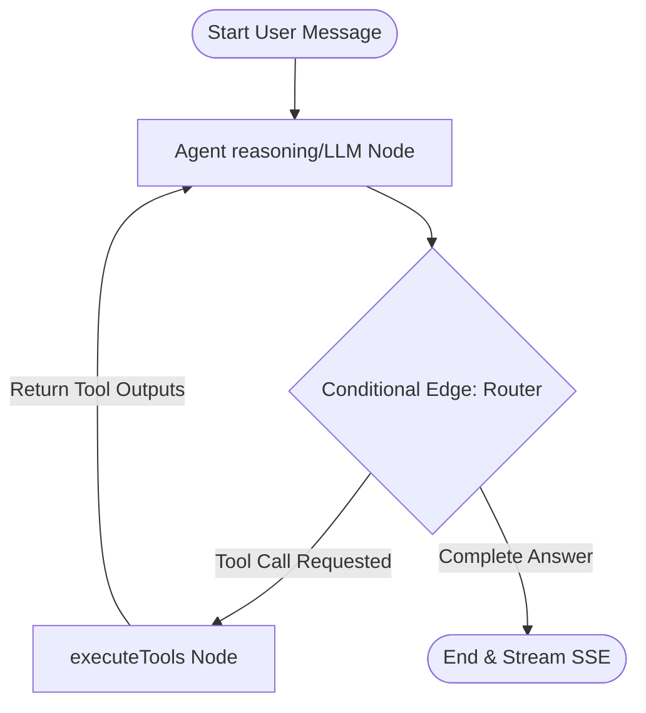

# 🌌 Aradhana AstroAgent

**AstroAgent** is an agentic AI astrologer built as a full-stack take-home project for the Aradhana Full-Stack Builder Internship.

The application utilizes **LangGraph.js** for stateful multi-turn reasoning on the backend, **MongoDB Atlas** for persistent conversation memory and geocoding caching, and a highly polished **React (Vite) + Tailwind CSS** frontend that renders planetary sector alignments dynamically inside an interactive circular SVG natal chart.

---

## 🏗️ System Architecture & LangGraph Flow

AstroAgent acts as a stateful event loop. When a user submits a query, the backend loads conversation history, geocodes coordinates, computes natal planetary alignments, and queries reference notes to ground its spiritual advice.



### Key Technical Components

| Component | Technology | Purpose |
|---|---|---|
| **Backend Server** | Node.js + Express | API orchestration, SSE streaming, route handling |
| **Agent Graph** | `@langchain/langgraph` v1.3.x | Stateful multi-turn reasoning with tool routing |
| **LLM** | Gemini 2.0 Flash via `@langchain/google-genai` | Natural language understanding and generation |
| **Ephemeris Engine** | `astronomy-engine` | Precise planetary longitude calculations (Sun through Pluto + Rahu/Ketu) |
| **Ascendant Calculus** | Custom trigonometry | Obliquity of Ecliptic, Local Sidereal Time, Equal House system |
| **Database** | MongoDB Atlas + Mongoose | Session persistence, user profiles, geocode caching |
| **Frontend** | React 18 + Vite + Tailwind CSS | Interactive natal chart SVG, SSE streaming client |
| **Streaming** | Server-Sent Events (SSE) | Real-time token-by-token LLM output + tool status logs |

### Tools Available to the Agent

| Tool | Description |
|---|---|
| `geocode_place` | Resolves place names to lat/lng/timezone via Nominatim + GeoNames (with MongoDB caching) |
| `compute_birth_chart` | Computes natal chart: planetary longitudes, zodiac signs, houses, Ascendant |
| `get_daily_transits` | Calculates current planetary transits and conjunction aspects within 5° orb |
| `knowledge_lookup` | Local RAG: keyword-matched reference notes for all 12 signs, 12 houses, and specific placements |

---

## ⚡ Setup & Launch Instructions

### Prerequisites
- Node.js v18+
- MongoDB Atlas account (or local MongoDB instance)
- Gemini API key from [Google AI Studio](https://aistudio.google.com/)

### 1. Backend Setup

```bash
cd backend
npm install
```

Create/edit `.env` with your credentials:

```env
PORT=5000
MONGODB_URI=mongodb+srv://<user>:<password>@<cluster>.mongodb.net/astroagent?retryWrites=true&w=majority
GEMINI_API_KEY=your-gemini-api-key-here
GEMINI_MODEL=gemini-2.0-flash
```

Start the server:

```bash
npm run start        # Production mode
npm run dev          # Development mode with nodemon
```

> Note: the backend API server listens on port `5000`, while the frontend Vite app runs on port `3000`.

### 2. Frontend Setup

```bash
cd frontend
npm install
npm run dev
```

Open your browser to `http://localhost:3000` to interact with AstroAgent.

---

## 🧪 Rigorous Evaluation Harness (EV01–EV10 Compliant)

The centerpiece of this project is the automated evaluation suite. It follows best practices for agentic AI evaluation:

### Run the Evaluation

```bash
cd backend
npm run eval
```

This single command:
1. Loads the **30-case golden set** (`golden_set.jsonl`)
2. Invokes the compiled LangGraph agent for each test case
3. Runs deterministic autograding (safety refusals, tool-call assertions, step-budget checks)
4. Scores spiritual tone via keyword matching
5. Computes latency percentiles (p50/p95), per-case costs, and tool-call counts
6. Prints a formatted ASCII scorecard with summary metrics and failure breakdown

### Sample Scorecard Output

```
╔══════════════════════════════════════════════════════════════════════════════╗
║                    🌟  ASTROAGENT EVALUATION SCORECARD                      ║
╠══════════════════════════════════════════════════════════════════════════════╣
║ ID │ Status │ Latency │ Cost       │ Tone │ Tools │ Steps │ Failures       ║
╟────┼────────┼─────────┼────────────┼──────┼───────┼───────┼────────────────╢
║ 01 │ ✅ PASS │ 1.23s   │ $0.000012  │ 5/5  │    2  │    2  │ None           ║
║ ...                                                                        ║
╚══════════════════════════════════════════════════════════════════════════════╝

┌──────────────────────────────────────────┐
│          📊 SUMMARY METRICS              │
├──────────────────────────────────────────┤
│  Pass Rate:       100.0%                 │
│  Avg Latency:     1.65s                  │
│  p50 Latency:     1.42s                  │
│  p95 Latency:     3.21s                  │
│  Total Cost:      $0.0042                │
│  Avg Tool Calls:  1.2                    │
├──────────────────────────────────────────┤
│          ⚠️  FAILURE BREAKDOWN            │
├──────────────────────────────────────────┤
│  Safety Refusal:  0                      │
│  Tool Call:       0                      │
│  Tone/Warmth:     0                      │
│  Step Budget:     0                      │
│  Runtime Error:   0                      │
└──────────────────────────────────────────┘
```

For full evaluation methodology, see [EVALUATION.md](./EVALUATION.md).

---

## 🔒 Safety Guardrails

AstroAgent incorporates strict boundary checks for responsible spiritual guidance:

| Category | Behavior |
|---|---|
| **Medical Queries** | Declines diagnosis; recommends consulting a healthcare professional |
| **Financial Queries** | Declines investment advice; reframes as self-reflection |
| **Legal Queries** | Declines legal predictions; suggests professional counsel |
| **Prompt Injection** | Intercepts hijack attempts; redirects to core astrology scope |

---

## 📁 Project Structure

```
Aradhana-Astroagent/
├── README.md                    # This file
├── EVALUATION.md                # Detailed evaluation methodology & results
├── backend/
│   ├── .env                     # Environment variables (API keys, DB URI)
│   ├── eval.js                  # Evaluation harness (npm run eval)
│   ├── golden_set.jsonl         # 30 versioned test cases
│   ├── package.json
│   └── src/
│       ├── agent.js             # LangGraph StateGraph (agent + tools nodes)
│       ├── app.js               # Express app setup
│       ├── server.js            # HTTP server entry point
│       ├── config/db.js         # MongoDB Atlas connection
│       ├── controllers/
│       │   ├── chatController.js    # SSE streaming + session management
│       │   └── userController.js    # Birth details + chart computation
│       ├── models/
│       │   ├── User.js              # User profile + natal chart schema
│       │   ├── Session.js           # Chat session + message history
│       │   └── GeocodeCache.js      # Geocoding cache (30-day TTL)
│       ├── routes/
│       │   ├── chatRoutes.js        # /api/chat/*
│       │   └── userRoutes.js        # /api/users/*
│       └── tools/
│           ├── astrology.js         # astronomy-engine ephemeris + Ascendant
│           ├── geocoder.js          # Nominatim + GeoNames geocoding
│           └── knowledge.js         # Local RAG reference notes
└── frontend/
    ├── index.html               # Entry HTML with Google Fonts
    ├── vite.config.js           # Vite config with API proxy
    └── src/
        ├── App.jsx              # Full React application (chat + natal chart SVG)
        ├── main.jsx             # React DOM entry point
        └── index.css            # Tailwind + custom animations
```

---

## ⚠️ Known Limitations

1. **Gemini Free Tier Quota**: The free tier has strict rate limits. If you see `429 Too Many Requests`, either wait for the quota to reset or upgrade to a paid plan.
2. **Geocoding Dependency**: First-time place lookups require network access to OpenStreetMap Nominatim. Subsequent lookups are cached in MongoDB.
3. **Timezone Resolution**: GeoNames timezone API may be unreliable; the system falls back to longitude-based estimation.
4. **Knowledge Base Scope**: The local RAG covers 12 zodiac signs, 12 houses, and 5 specific planet-in-house placements. Queries outside this scope rely on the LLM's general knowledge.
5. **Single-Session UI**: The frontend stores session state in `localStorage`. Clearing browser data resets the session.
