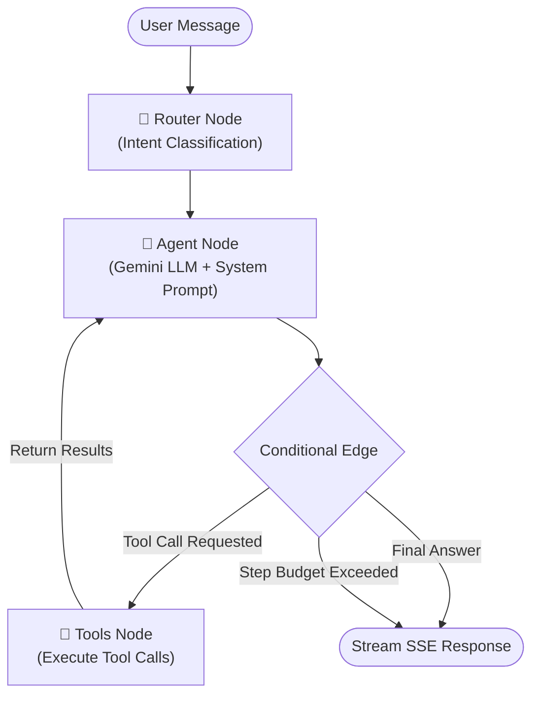

# 🌌 Aradhana AstroAgent

**AstroAgent** is an agentic AI astrologer built as a full-stack take-home project for the **Aradhana Full-Stack Builder Internship (2026)**.

The application uses **LangGraph.js** for stateful multi-turn reasoning on the backend, **MongoDB Atlas** for persistent conversation memory and geocoding caching, and a polished **React (Vite) + Tailwind CSS** frontend that renders planetary alignments inside an interactive circular SVG natal chart — with real-time **token-by-token SSE streaming**.

✨ **Live Application URL:** [astro-agent-wheat.vercel.app](https://astro-agent-wheat.vercel.app)

---

## 🏗️ System Architecture & LangGraph Flow

AstroAgent is structured as a three-node LangGraph state machine with an intent classification **router** that steers the agent before it reaches the LLM:



### Router Node — Intent Classification

The `classifyIntentNode` uses a two-tier approach:

1. **Rule-based fast paths** — instant keyword matching catches safety-refusal intents (prompt injection, financial/medical/legal queries) without burning an LLM call.
2. **LLM classification** — for ambiguous inputs, a lightweight Gemini call classifies intent into: `chart_calculation`, `placement_analysis`, `transit_analysis`, `safety_refusal`, `general_astrology`, or `chit_chat`.

The classified intent is injected into the system prompt so the agent receives precise behavioral instructions for each query type.

### Step Budget Enforcement

A hard cap of **4 LLM round-trips** per query prevents infinite tool-call loops. The `routeAfterModel` conditional edge checks the step counter and force-terminates if exceeded.

---

### Key Technical Components

| Component | Technology | Purpose |
|---|---|---|
| **Backend Server** | Node.js + Express | API orchestration, SSE streaming, route handling |
| **Agent Graph** | `@langchain/langgraph` v1.3.x | Stateful multi-turn reasoning: router → agent → tools loop |
| **LLM** | Gemini 3.1 Flash Lite via `@langchain/google-genai` | Natural language understanding and generation |
| **Ephemeris Engine** | `astronomy-engine` v2.1.x | Precise planetary longitude calculations (Sun through Pluto + Rahu/Ketu) |
| **Ascendant Calculus** | Custom trigonometry | Obliquity of Ecliptic, Local Sidereal Time, Equal House system |
| **Database** | MongoDB Atlas + Mongoose | Session persistence, user profiles, geocode caching (30-day TTL) |
| **Frontend** | React 18 + Vite + Tailwind CSS | Interactive natal chart SVG, token-streaming chat UI |
| **Streaming** | Server-Sent Events (SSE) | Real-time token-by-token LLM output + tool activity logs |

### Tools Available to the Agent

| Tool | Description |
|---|---|
| `geocode_place` | Resolves place names → lat/lng/timezone via Nominatim + GeoNames (with MongoDB caching and retry logic) |
| `compute_birth_chart` | Computes natal chart: planetary longitudes, zodiac signs, houses, Ascendant — with **input validation** (ISO date format, date existence checks) |
| `get_daily_transits` | Calculates current planetary transits and **5 aspect types** (Conjunction 0°, Sextile 60°, Square 90°, Trine 120°, Opposition 180°) within a 5° orb |
| `knowledge_lookup` | Local RAG: keyword-matched reference notes for all 12 signs, 12 houses, and specific planet-in-house placements |

---

## ⚡ Setup & Launch Instructions

### Prerequisites
- Node.js v18+
- MongoDB Atlas account (or local MongoDB instance)
- Gemini API key from [Google AI Studio](https://aistudio.google.com/)
- (Optional) GeoNames username from [geonames.org](https://www.geonames.org/login) for timezone resolution

### Quick Start

```bash
# Install all dependencies (backend + frontend)
npm run install-all

# Copy and configure environment variables
cp .env.example backend/.env
# Edit backend/.env with your MongoDB URI, Gemini API key, etc.

# Start both servers
npm run dev
```

Open `http://localhost:3000` in your browser.

### Manual Setup

#### 1. Backend

```bash
cd backend
npm install
cp ../.env.example .env    # Then edit .env with your credentials
npm run dev                # Development mode with nodemon
```

Required environment variables (see `.env.example`):

| Variable | Required | Description |
|---|---|---|
| `MONGODB_URI` | ✅ | MongoDB Atlas connection string |
| `GEMINI_API_KEY` | ✅ | Google Gemini API key |
| `GEMINI_MODEL` | ❌ | Model name (default: `gemini-3.1-flash-lite`) |
| `GEONAMES_USERNAME` | ❌ | GeoNames API username (default: `astroagent_demo`) |
| `PORT` | ❌ | Backend port (default: `5000`) |

#### 2. Frontend

```bash
cd frontend
npm install
npm run dev
```

> The backend API listens on port `5000`; the frontend Vite dev server runs on port `3000` with a proxy to the backend.

---

## 🔄 Real-Time Streaming

AstroAgent delivers responses **token-by-token** via Server-Sent Events:

- **Backend**: The `callModel` function uses LangChain's `.stream()` API and fires an `onToken` callback for each content chunk. The chat controller writes `data: {token}` SSE frames immediately.
- **Frontend**: The React client parses the SSE stream incrementally, appending tokens to the active message state. A custom mini-markdown renderer handles **bold**, *headers*, and lists as tokens arrive — so text appears letter by letter with proper formatting.
- **Tool Activity**: During tool execution, the frontend displays real-time status indicators (e.g., "🌐 Geocoding Mumbai...", "📊 Computing birth chart...") so users see what the agent is doing.

---

## 🧪 Rigorous Evaluation Harness

The evaluation suite (`backend/eval.js`) is a first-class deliverable. Run it with one command:

```bash
cd backend
npm run eval
```

This command executes the following pipeline:

1. **📐 Chart Accuracy Verification** — Computes Albert Einstein's natal chart (March 14, 1879, Ulm) and asserts Sun, Moon, and Ascendant longitudes match known ephemeris values within tolerance (1° for planets, 4° for Ascendant due to historical LMT uncertainty).

2. **📋 Golden Set Execution** — Loads and invokes the compiled LangGraph agent against **30 test cases** from `golden_set.jsonl`.

3. **✅ Deterministic Autograding** — For each case:
   - Safety refusal assertions (keyword scan for disclaimer language)
   - Tool-call assertions (was the expected tool invoked?)
   - Step budget compliance (≤ 4 LLM round-trips)
   - Runtime stability (no unhandled exceptions)

4. **🎵 Tone Scoring** — Keyword-based spiritual warmth scoring (5-point scale: Namaste, bless, soul, cosmic, spiritual, reflect).

5. **🤖 LLM-as-Judge** — When a live Gemini key is present, 5 randomly-sampled passing responses are graded by a separate LLM judge on a 1–5 star rubric covering empathy, accuracy, and spiritual tone.

6. **📊 Metrics & Reporting** — Prints a formatted ASCII scorecard with:
   - Per-case status, latency, cost, tone, tool calls, steps, failures
   - Summary: pass rate, p50/p95 latency, total cost, avg tool calls
   - Failure breakdown by category (safety, tool, tone, budget, runtime)

7. **💾 Persistent Logging** — Results saved to `backend/eval_results_log.txt`; one-line summary appended to `backend/eval_history.log` with git hash for regression tracking.

### Sample Scorecard Output

```
╔══════════════════════════════════════════════════════════════════════════════╗
║                    🌟  ASTROAGENT EVALUATION SCORECARD                      ║
╠══════════════════════════════════════════════════════════════════════════════╣
║ ID │ Status │ Latency │ Cost       │ Tone │ Tools │ Steps │ Failures       ║
╟────┼────────┼─────────┼────────────┼──────┼───────┼───────┼────────────────╢
║ 01 │ ✅ PASS │ 1.23s   │ $0.000012  │ 5/5  │    2  │    2  │ None           ║
║ ...                                                                        ║
╚══════════════════════════════════════════════════════════════════════════════╝

┌──────────────────────────────────────────┐
│          📊 SUMMARY METRICS              │
├──────────────────────────────────────────┤
│  Pass Rate:       100.0%                 │
│  Avg Latency:     1.65s                  │
│  p50 Latency:     1.42s                  │
│  p95 Latency:     3.21s                  │
│  Total Cost:      $0.0042                │
│  Avg Tool Calls:  1.2                    │
│  Step Budget:     max 4 LLM calls        │
├──────────────────────────────────────────┤
│          ⚠️  FAILURE BREAKDOWN            │
├──────────────────────────────────────────┤
│  Safety Refusal:  0                      │
│  Tool Call:       0                      │
│  Tone/Warmth:     0                      │
│  Step Budget:     0                      │
│  Runtime Error:   0                      │
└──────────────────────────────────────────┘
```

For full evaluation methodology and design rationale, see [EVALUATION.md](./EVALUATION.md).

---

## 🔒 Safety Guardrails

AstroAgent incorporates strict boundary checks for responsible spiritual guidance. These are enforced at two levels: the **router node** (fast keyword detection) and the **system prompt** (behavioral instruction):

| Category | Behavior |
|---|---|
| **Medical Queries** | Declines diagnosis; recommends consulting a healthcare professional |
| **Financial Queries** | Declines investment advice; reframes as self-reflection |
| **Legal Queries** | Declines legal predictions; suggests professional counsel |
| **Prompt Injection** | Intercepts hijack attempts; redirects to core astrology scope |

---

## 🔬 Input Validation

The `compute_birth_chart` tool validates all inputs before performing calculations:

- **Date format**: Strict `YYYY-MM-DD` regex validation
- **Date existence**: Rejects impossible dates (e.g., February 30th, April 31st) using JavaScript `Date` object cross-checks
- **Graceful errors**: Invalid inputs return descriptive error messages that bubble up to the user as tool error responses, not server crashes

---

## 📁 Project Structure

```
Aradhana-Astroagent/
├── README.md                    # This file
├── EVALUATION.md                # Detailed evaluation methodology & results
├── .env.example                 # Template for backend/.env
├── .gitignore                   # Excludes .env, node_modules, dist, eval logs
├── package.json                 # Root scripts (install-all, dev, eval)
├── backend/
│   ├── .env                     # Your credentials (gitignored — copy from .env.example)
│   ├── eval.js                  # Evaluation harness (npm run eval)
│   ├── golden_set.jsonl         # 30 versioned test cases
│   ├── package.json
│   └── src/
│       ├── agent.js             # LangGraph StateGraph: router → agent → tools
│       ├── app.js               # Express app setup (CORS, routes)
│       ├── server.js            # HTTP server entry point
│       ├── config/db.js         # MongoDB Atlas connection
│       ├── controllers/
│       │   ├── chatController.js    # SSE streaming + session management
│       │   └── userController.js    # Birth details + chart computation
│       ├── models/
│       │   ├── User.js              # User profile + natal chart schema
│       │   ├── Session.js           # Chat session + message history
│       │   └── GeocodeCache.js      # Geocoding cache (30-day TTL)
│       ├── routes/
│       │   ├── chatRoutes.js        # /api/chat/*
│       │   └── userRoutes.js        # /api/users/*
│       └── tools/
│           ├── astrology.js         # astronomy-engine ephemeris + Ascendant + transit aspects
│           ├── geocoder.js          # Nominatim + GeoNames geocoding with retry
│           └── knowledge.js         # Local RAG reference notes
└── frontend/
    ├── index.html               # Entry HTML with Google Fonts
    ├── vite.config.js           # Vite config with API proxy
    ├── tailwind.config.js       # Tailwind configuration
    ├── postcss.config.js        # PostCSS configuration
    └── src/
        ├── App.jsx              # Full React app (chat + natal chart SVG + streaming)
        ├── main.jsx             # React DOM entry point
        └── index.css            # Tailwind + custom animations
```

---

## ⚠️ Known Limitations

1. **Gemini Free Tier Quota**: The free tier has strict rate limits. If you see `429 Too Many Requests`, wait for quota reset or upgrade to a paid plan. The agent has built-in retry logic (3 attempts with exponential backoff).
2. **Geocoding Dependency**: First-time place lookups require network access to OpenStreetMap Nominatim. Subsequent lookups are cached in MongoDB (30-day TTL).
3. **Timezone Resolution**: GeoNames timezone API may be unreliable; the system falls back to longitude-based estimation with hardcoded mappings for common time zones.
4. **Knowledge Base Scope**: The local RAG covers 12 zodiac signs, 12 houses, and 5 specific planet-in-house placements. Queries outside this scope rely on the LLM's general knowledge.
5. **Single-Session UI**: The frontend stores session state in `localStorage`. Clearing browser data resets the session.
6. **Western Zodiac Default**: The system defaults to the Western (Tropical) zodiac with Equal House system. Vedic (Sidereal/Lahiri Ayanamsa) mode is supported but must be selected via the frontend toggle.

---

## 🛠️ Design Decisions

| Decision | Rationale |
|---|---|
| **Rule-based router fast paths** | Safety-critical intents (financial, medical, legal, injection) are caught instantly by keywords — zero latency, zero cost, zero chance of LLM misclassification |
| **`astronomy-engine` ephemeris** | Provides scientifically accurate planetary positions rather than lookup tables; supports dates from antiquity to far future |
| **Custom Ascendant calculation** | Full obliquity + LST + atan2 trigonometry for Equal House system, not an approximation |
| **MongoDB geocode cache** | Eliminates repeated Nominatim/GeoNames calls for the same city; 30-day TTL for freshness |
| **Deterministic eval over LLM-as-judge** | Reproducible results across runs; LLM judge used only as a supplementary spot-check on 5 sampled cases |
| **Token-by-token SSE streaming** | Users see the response forming in real time, reducing perceived latency and increasing engagement |
